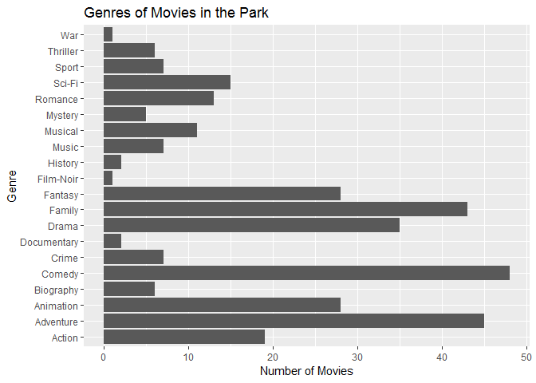
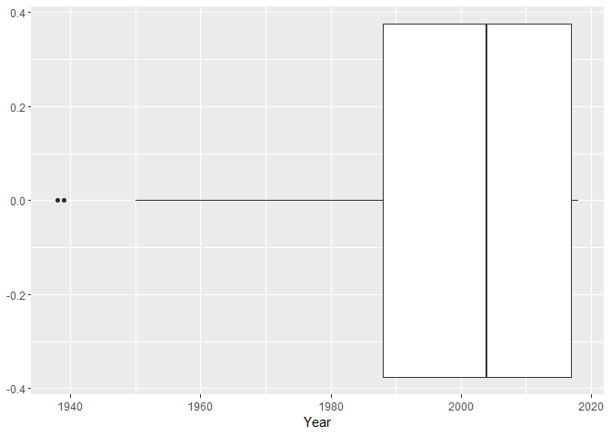
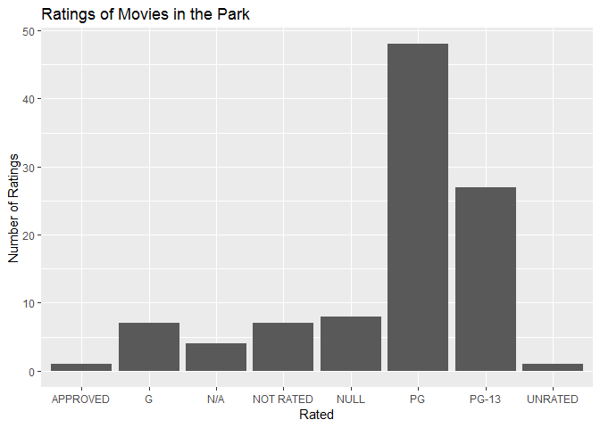

Movies in the Park
================
Paul Alves
November 23, 2018

This document analyzes different facts about the Movies in the Park series hosted in 2018. This was a series of movie screenings hosted outdoors at a public park. The movie selection varied from classics to modern films. An analysis of the variety of movies available is presented in order to determine the purpose of the events.

Genres
------

The following graph lists the number of movies in each genre hosted in the series.

Popular genres included comedy, adventure, and family movies. This makes sense since the movies are more marketed towards families especially with children. There was a war film shown, which turned out to be Wonder Woman. This does not fit with what one would typically think of a war film. The data on the Open Movie Database may not be entirely accurate in this regard. There does not appear to be any unfitting or questionable genres in the data.

Years
-----

The range of years the movies came out in is also interesting to analyze.

The resulting graph shows most movies were made between about 1990 to 2018. This means that more of the movies seem to be modern. There are a few outliers earlier on around the 1930s and 40s. This means that the events have a focus on more modern movies. Wonder Woman and Coco for example were played. This makes it attractive to the teen and young adult audience.

Ratings
-------

In order to determine what audience the movie events are aimed at, a summary of ratings would suffice. Below is a graph showing the ratings.

PG was the most common rating at 48 movies. PG-13 was the next most popular at 27 movies. Interestingly, the G rating only had 7 movies. The other coulmns are variations of the "Not Rated", which total to about 21 films. A glance at these films seem to be a few earlier films before a rating system was devised, or smaller indie productions. This is interesting as the data now skews the event to gear more towards teenagers and young adults, rather than younger children. This may make sense if the intent of the program was to keep younger adults from getting into trouble by offering movies. This would need to be researched more into the intent of the program.

Conclusions
-----------

The movies seem to be focused on family friendly genres with a modern selection. The ratings however suggest that the aim is more at young adults rather than smaller children. There are a wide variety of higher and unrated movies. The events try to cater to a wide audience while remaining interesting. A further analysis could be done to map location and these attributes as well.

Session Info
------------

    ## - Session info ----------------------------------------------------------
    ##  setting  value                       
    ##  version  R version 3.5.1 (2018-07-02)
    ##  os       Windows 7 x64 SP 1          
    ##  system   x86_64, mingw32             
    ##  ui       RTerm                       
    ##  language (EN)                        
    ##  collate  English_United States.1252  
    ##  ctype    English_United States.1252  
    ##  tz       America/Chicago             
    ##  date     2018-11-24                  
    ## 
    ## - Packages --------------------------------------------------------------
    ##  package     * version   date       lib source        
    ##  assertthat    0.2.0     2017-04-11 [1] CRAN (R 3.5.1)
    ##  backports     1.1.2     2017-12-13 [1] CRAN (R 3.5.0)
    ##  base64enc     0.1-3     2015-07-28 [1] CRAN (R 3.5.0)
    ##  bindr         0.1.1     2018-03-13 [1] CRAN (R 3.5.1)
    ##  bindrcpp    * 0.2.2     2018-03-29 [1] CRAN (R 3.5.1)
    ##  broom         0.5.0     2018-07-17 [1] CRAN (R 3.5.1)
    ##  callr         3.0.0     2018-08-24 [1] CRAN (R 3.5.1)
    ##  cellranger    1.1.0     2016-07-27 [1] CRAN (R 3.5.1)
    ##  cli           1.0.1     2018-09-25 [1] CRAN (R 3.5.1)
    ##  colorspace    1.3-2     2016-12-14 [1] CRAN (R 3.5.1)
    ##  crayon        1.3.4     2017-09-16 [1] CRAN (R 3.5.1)
    ##  curl        * 3.2       2018-03-28 [1] CRAN (R 3.5.1)
    ##  desc          1.2.0     2018-05-01 [1] CRAN (R 3.5.1)
    ##  devtools      2.0.1     2018-10-26 [1] CRAN (R 3.5.1)
    ##  digest        0.6.18    2018-10-10 [1] CRAN (R 3.5.1)
    ##  dplyr       * 0.7.8     2018-11-10 [1] CRAN (R 3.5.1)
    ##  evaluate      0.12      2018-10-09 [1] CRAN (R 3.5.1)
    ##  forcats     * 0.3.0     2018-02-19 [1] CRAN (R 3.5.1)
    ##  fs            1.2.6     2018-08-23 [1] CRAN (R 3.5.1)
    ##  ggplot2     * 3.1.0     2018-10-25 [1] CRAN (R 3.5.1)
    ##  glue          1.3.0     2018-07-17 [1] CRAN (R 3.5.1)
    ##  gtable        0.2.0     2016-02-26 [1] CRAN (R 3.5.1)
    ##  haven         1.1.2     2018-06-27 [1] CRAN (R 3.5.1)
    ##  hms           0.4.2     2018-03-10 [1] CRAN (R 3.5.1)
    ##  htmltools     0.3.6     2017-04-28 [1] CRAN (R 3.5.1)
    ##  httr        * 1.3.1     2017-08-20 [1] CRAN (R 3.5.1)
    ##  jsonlite    * 1.5       2017-06-01 [1] CRAN (R 3.5.1)
    ##  knitr         1.20      2018-02-20 [1] CRAN (R 3.5.1)
    ##  labeling      0.3       2014-08-23 [1] CRAN (R 3.5.0)
    ##  lattice       0.20-35   2017-03-25 [2] CRAN (R 3.5.1)
    ##  lazyeval      0.2.1     2017-10-29 [1] CRAN (R 3.5.1)
    ##  lubridate     1.7.4     2018-04-11 [1] CRAN (R 3.5.1)
    ##  magrittr      1.5       2014-11-22 [1] CRAN (R 3.5.1)
    ##  memoise       1.1.0     2017-04-21 [1] CRAN (R 3.5.1)
    ##  modelr        0.1.2     2018-05-11 [1] CRAN (R 3.5.1)
    ##  munsell       0.5.0     2018-06-12 [1] CRAN (R 3.5.1)
    ##  nlme          3.1-137   2018-04-07 [2] CRAN (R 3.5.1)
    ##  pillar        1.3.0     2018-07-14 [1] CRAN (R 3.5.1)
    ##  pkgbuild      1.0.2     2018-10-16 [1] CRAN (R 3.5.1)
    ##  pkgconfig     2.0.2     2018-08-16 [1] CRAN (R 3.5.1)
    ##  pkgload       1.0.2     2018-10-29 [1] CRAN (R 3.5.1)
    ##  plyr          1.8.4     2016-06-08 [1] CRAN (R 3.5.1)
    ##  prettyunits   1.0.2     2015-07-13 [1] CRAN (R 3.5.1)
    ##  processx      3.2.0     2018-08-16 [1] CRAN (R 3.5.1)
    ##  ps            1.2.1     2018-11-06 [1] CRAN (R 3.5.1)
    ##  purrr       * 0.2.5     2018-05-29 [1] CRAN (R 3.5.1)
    ##  R6            2.3.0     2018-10-04 [1] CRAN (R 3.5.1)
    ##  Rcpp          1.0.0     2018-11-07 [1] CRAN (R 3.5.1)
    ##  readr       * 1.1.1     2017-05-16 [1] CRAN (R 3.5.1)
    ##  readxl        1.1.0     2018-04-20 [1] CRAN (R 3.5.1)
    ##  remotes       2.0.2     2018-10-30 [1] CRAN (R 3.5.1)
    ##  rlang         0.3.0.1   2018-10-25 [1] CRAN (R 3.5.1)
    ##  rmarkdown     1.10      2018-06-11 [1] CRAN (R 3.5.1)
    ##  rprojroot     1.3-2     2018-01-03 [1] CRAN (R 3.5.1)
    ##  rstudioapi    0.8       2018-10-02 [1] CRAN (R 3.5.1)
    ##  rvest         0.3.2     2016-06-17 [1] CRAN (R 3.5.1)
    ##  scales        1.0.0     2018-08-09 [1] CRAN (R 3.5.1)
    ##  sessioninfo   1.1.1     2018-11-05 [1] CRAN (R 3.5.1)
    ##  stringi       1.2.4     2018-07-20 [1] CRAN (R 3.5.1)
    ##  stringr     * 1.3.1     2018-05-10 [1] CRAN (R 3.5.1)
    ##  testthat      2.0.1     2018-10-13 [1] CRAN (R 3.5.1)
    ##  tibble      * 1.4.2     2018-01-22 [1] CRAN (R 3.5.1)
    ##  tidyr       * 0.8.2     2018-10-28 [1] CRAN (R 3.5.1)
    ##  tidyselect    0.2.5     2018-10-11 [1] CRAN (R 3.5.1)
    ##  tidyverse   * 1.2.1     2017-11-14 [1] CRAN (R 3.5.1)
    ##  usethis       1.4.0     2018-08-14 [1] CRAN (R 3.5.1)
    ##  withr         2.1.2     2018-03-15 [1] CRAN (R 3.5.1)
    ##  XML         * 3.98-1.16 2018-08-19 [1] CRAN (R 3.5.1)
    ##  xml2          1.2.0     2018-01-24 [1] CRAN (R 3.5.1)
    ##  yaml          2.2.0     2018-07-25 [1] CRAN (R 3.5.1)
    ## 
    ## [1] C:/Users/New User/Documents/R/win-library/3.5
    ## [2] C:/Program Files/R/R-3.5.1/library
